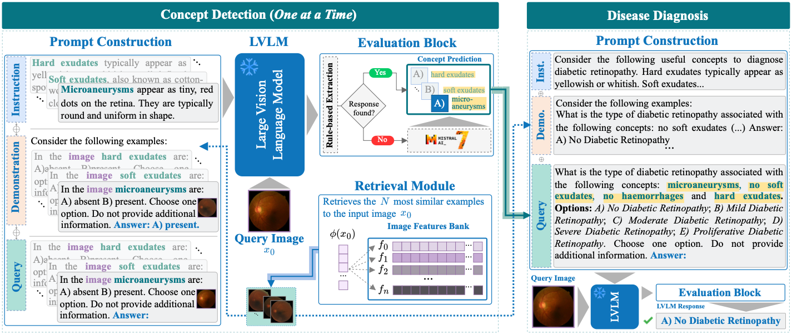

# CBVLM: Training-free Explainable Concept-based Large Vision Language Models for Medical Image Classification

<p align="center">
📝 <a href="https://arxiv.org/abs/2501.12266" target="_blank">Paper</a> • 🪄 <a href="https://cristianopatricio.github.io/CBVLM/" target="_blank">Project</a>
</p>

## Abstract
The main challenges limiting the adoption of deep learning-based solutions in medical workflows are the availability of annotated data and the lack of interpretability of such systems. Concept Bottleneck Models (CBMs) tackle the latter by constraining the final disease prediction on a set of predefined and human-interpretable concepts. However, the increased interpretability achieved through these concept-based explanations implies a higher annotation burden. Moreover, if a new concept needs to be added, the whole system needs to be retrained. Inspired by the remarkable performance shown by Large Vision-Language Models (LVLMs) in few-shot settings, we propose a simple, yet effective, methodology, CBVLM, which tackles both of the aforementioned challenges. First, for each concept, we prompt the LVLM to answer if the concept is present in the input image. Then, we ask the LVLM to classify the image based on the previous concept predictions. Moreover, in both stages, we incorporate a retrieval module responsible for selecting the best examples for in-context learning. By grounding the final diagnosis on the predicted concepts, we ensure explainability, and by leveraging the few-shot capabilities of LVLMs, we drastically lower the annotation cost. We validate our approach with extensive experiments across four medical datasets and twelve LVLMs (both generic and medical) and show that CBVLM consistently outperforms CBMs and task-specific supervised methods without requiring any training and using just a few annotated examples. More information on our project page: https://cristianopatricio.github.io/CBVLM/.

<p align="center"></p>


## ⚡️ Highlights 🔥  
- A novel methodology (***CBVLM***) using Large Vision Language Models (LVLMs) to provide concept-based explanations for medical image classification.
- Explainability and transparency in the decision-making process are obtained by grounding the final diagnosis on the predicted concepts.
- ***CBVLM*** does not require any training and allows including other concepts easily.
- Extensive validation on four medical benchmarks and twelve open-source LVLMs.
- ***CBVLM*** outperforms dataset-specific fully supervised models and concept-based models (CBMs).

---

## 1. Download data

- *Derm7pt*: [Download](https://derm.cs.sfu.ca/Welcome.html)
- *SkinCon*: [Download](https://skincon-dataset.github.io/index.html#dataset) (only Fitzpatrick17k images)
- *CORDA*: [Download](https://zenodo.org/records/7821611)
- *DDR*: [Download](https://github.com/nkicsl/DDR-dataset) | See documentation at [Intructions for download and use of DDR dataset](docs/DDR_dataset_download_instructions.md)


## 2. Installation

2.1 Clone this repository and navigate to the folder:
```bash
git clone https://github.com/CristianoPatricio/CBVLM.git
cd CBVLM/
```

2.2 Create the required conda environments from the provided `yaml` files:

```bash
conda env create -f environment.yaml
conda activate cbvlm    # Run to activate

conda env create -f environment_llavaov.yaml
conda activate llava-ov # Run to activate

conda env create -f environment_vila.yaml
conda activate vila # Run to activate
```

2.3 Run `pip install -r requirements.txt` to install additional packages required for global running.
```bash
pip install -r requirements.txt
```
**Note:** Refer to [docs/setup-MM-LLMs-help-docs/](docs/setup-MM-LLMs-help-docs/) for additional information in setting up MM-LLMs.

2.4 Clone the repository of **MedImageInsight**:
```bash
git lfs install
git clone https://huggingface.co/lion-ai/MedImageInsights
```

and then move the folder `2024.09.27` to `CBVLM/src/models/MedImageInsights` 

## 3. Configure paths

Open the file `CBVLM/var_environment.env` and set your own paths:
```bash
DATA_DIR=/path/to/datasets/folder
LOG_DIR=/home/user/CBVLM/logs # this will log files into the CBVLM folder
PROJECT_ROOT=/home/user/CBVLM # path to the CBVLM folder

# for med-flamingo
# refer to CBVLM/docs/setup-MM-LLMs-help-docs/setup_med-flamingo.md to get instructions on how to download llama-7B
LLAMA_PATH=/home/user/decapoda-research-llama-7B-hf

# for skingpt4
# refer to CBVLM/docs/setup-MM-LLMs-help-docs/setup_SkinGPT-4.md to get instructions on how to download llama-2-13b-chat and skingpt4 checkpoint
LLAMA2_PATH=/home/user/CBVLM/Llama-2-13b-chat-hf
SKINGPT4_PATH=/home/user/CBVLM/skingpt4_llama2_13bchat_base_pretrain_stage2.pth
```

## 4. Inference

### Available models:
```
med-flamingo
open-flamingo
chexagent
llava-med
vila8B
skingpt4
llava-ov
qwen2-vl
minicpm
internvl2
idefics3
mplug
```

### 4.1 Extract features
```bash
python extract_features.py data=derm7pt,CORDA,DDR,fitzpatrick name=medimageinsight bs=1
```

### 4.2 Concept Detection

```bash
# Zero-shot
python run_concepts.py --multirun n_demos=0 data=derm7pt,CORDA,DDR,fitzpatrick17k name={insert_model_name} 

# Few-shot
python run_concepts.py --multirun n_demos=1,2,4 data=derm7pt,CORDA,DDR,fitzpatrick17k name={insert_model_name}  demo_selection=rices feature_extractor=medimageinsight bs=1 
```

### 4.3 Disease Diagnosis
```bash
# Without concepts
python run_classification.py --multirun n_demos=0 data=derm7pt,CORDA,DDR,fitzpatrick17k name={insert_model_name}  feature_extractor=medimageinsight use_concepts=null bs=1

# Zero-shot
python run_classification.py --multirun n_demos=0 data=derm7pt,CORDA,DDR,fitzpatrick17k name={insert_model_name}  feature_extractor=medimageinsight use_concepts=automatic bs=1

# Few-shot
python run_classification.py --multirun n_demos=1,2,4 data=derm7pt,CORDA,DDR,fitzpatrick17k name={insert_model_name}  demo_selection=rices feature_extractor=medimageinsight use_concepts=automatic bs=1
```

### 4.4 Get metrics
```bash
python process_metrics.py logs/multiruns
```

## Citation

If you use this repository, please cite:

```txt
@article{patricio2025cbvlm,
  title={CBVLM: Training-free Explainable Concept-based Large Vision Language Models for Medical Image Classification},
  author={Patr{\'\i}cio, Cristiano and Rio-Torto, Isabel and Cardoso, Jaime S and Teixeira, Lu{\'\i}s F and Neves, Jo{\~a}o C},
  journal={arXiv preprint arXiv:2501.12266},
  year={2025}
}
```
